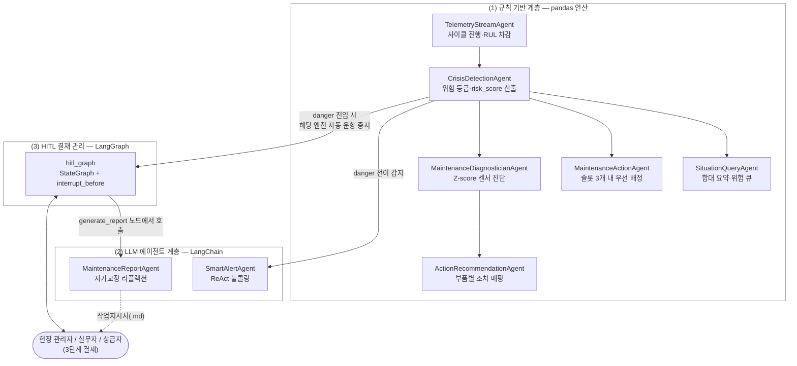
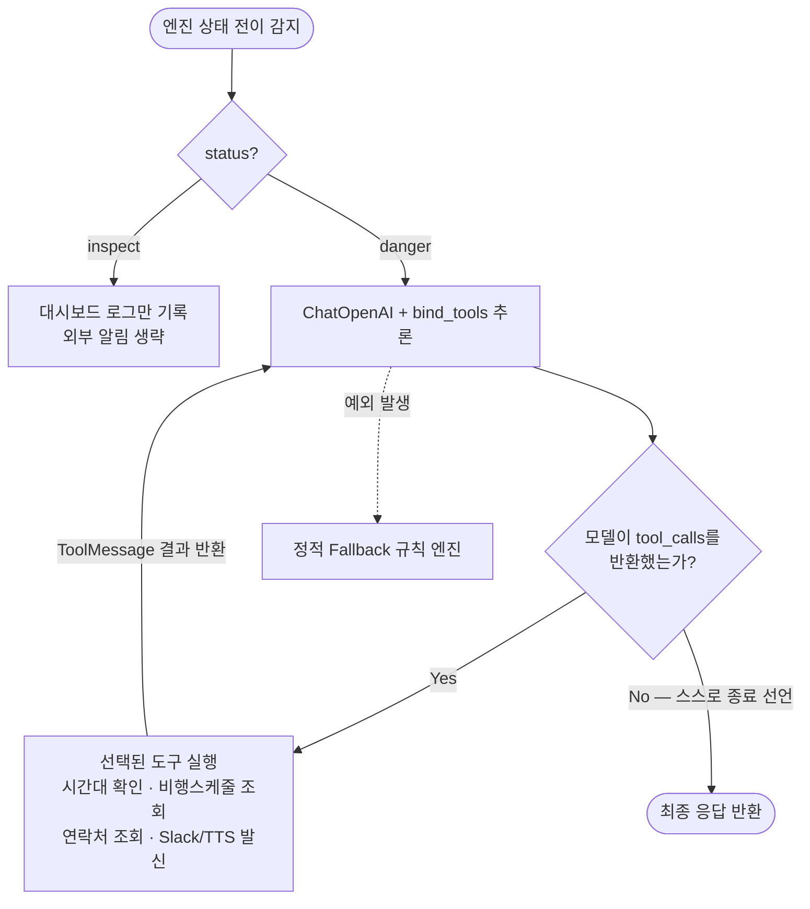
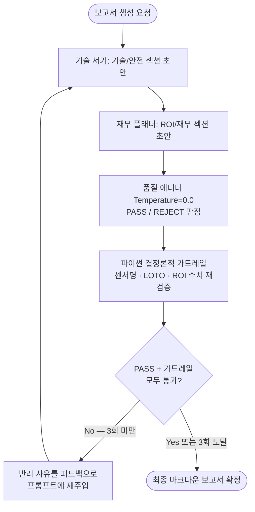
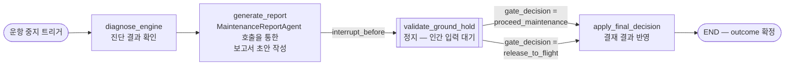
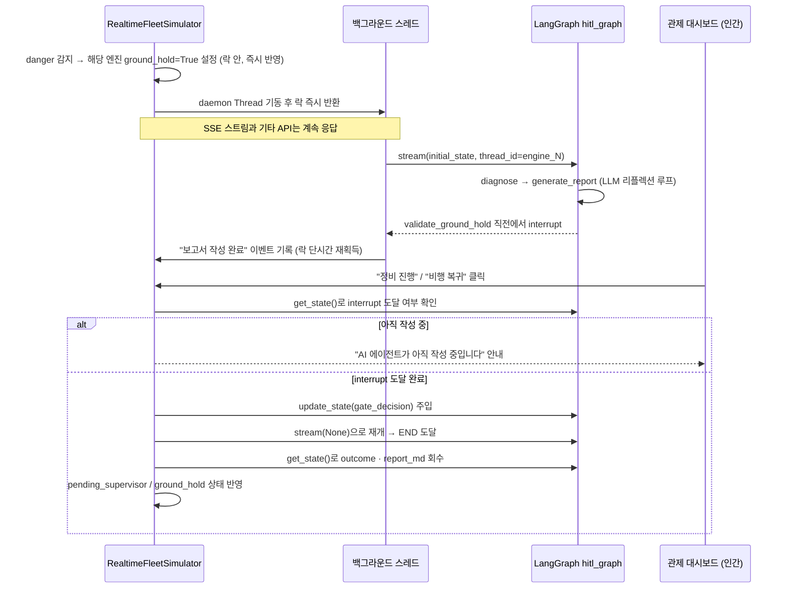

# ENGINE CHECK AGENT: 제트엔진 예지보전 및 HITL MRO 관제 플랫폼

NASA C-MAPSS 제트엔진 데이터셋을 기반으로 **엔진의 잔존 수명(RUL, Remaining Useful Life)** 을 예측하고, 이 예측 결과를 **LangChain / LangGraph 기반 AI 에이전트** 및 **인간 결재 절차(HITL, Human-in-the-Loop)** 와 결합하여, 제한된 정비 슬롯 환경에서 100대 규모 함대의 예방정비를 실시간으로 관리하는 대시보드입니다.

> **한 줄 요약**: 위험 상태로 진입한 엔진을 시스템이 자동으로 운항 중지시키고, AI가 진단 및 정비 보고서를 작성해 상신하면, 현장 관리자가 이를 검토 및 결재하여 정비를 집행합니다.

---

## 시스템 아키텍처

본 프로젝트는 다음 세 계층으로 구성됩니다.

- **(1) 규칙 기반 계층** — 텔레메트리를 수신하여 위험도를 산출하는 부분. pandas 기반 결정론적 연산만 사용합니다.
- **(2) LLM 에이전트 계층** — 알람 판단, 보고서 작성 등 상황에 따라 유연한 판단이 필요한 부분. LangChain으로 구현되어 있습니다.
- **(3) HITL 결재 관리 계층** — 인간의 결재 절차와 그 사이의 상태를 관리하는 부분. LangGraph로 구현되어 있습니다.

세 계층은 아래와 같이 연결됩니다.



**흐름 요약**:
1. 규칙 기반 계층이 매 초 엔진 상태를 갱신하다가, 특정 엔진이 `danger` 상태로 전이되면,
2. LangGraph(`hitl_graph`)가 해당 엔진 단위로 결재 절차를 개시합니다. 절차 중간에 LangChain 에이전트(`MaintenanceReportAgent`)를 호출하여 보고서를 작성하며,
3. 인간의 결재 입력을 대기하다가, 결재가 반영되면 그 결과를 규칙 기반 계층의 상태에 다시 반영합니다.
4. 별도로, 알람이 필요한 시점에는 `SmartAlertAgent`가 Slack 또는 자동 TTS 전화 등의 수단으로 담당자에게 통지합니다.

각 계층의 구성 요소는 다음과 같습니다.

| 계층 | 구성 요소 | 역할 |
|---|---|---|
| (1) 규칙 기반 | `TelemetryStream` · `CrisisDetection` · `SituationQuery` · `MaintenanceAction` · `MaintenanceDiagnostician` · `ActionRecommendation` (6종) | 규칙에 따른 결정론적 연산 수행. LLM 미사용. 시뮬레이션 환경 및 트리거 소스 역할 |
| (2) LLM 에이전트 | `SmartAlertAgent` · `MaintenanceReportAgent` (2종) | 상황에 따라 도구를 자율 선택하거나, 결과를 재관찰하여 스스로 수정 |
| (3) HITL 결재 관리 | `hitl_graph` (1종) | 인간 결재 절차의 진행 상태를 영속화 및 정지·재개 |

---

## 핵심 기능

### 1. 잔존 수명(RUL) 예측과 불확실성 산출
- **앙상블 예측**: Random Forest 회귀 모델로 엔진의 잔존 수명(RUL)을 예측합니다.
- **불확실성(σ) 동시 산출**: 앙상블 내 개별 Decision Tree들의 예측 편차(표준편차)를 함께 산출하여, 예측치의 신뢰도를 정량적으로 확인할 수 있습니다.
- **RUL 상한 클리핑(125 사이클)**: 초기 사용 구간의 라벨 노이즈를 억제하기 위해 RUL 라벨을 125 사이클로 상한 처리하여, 회귀 정확도(RMSE)를 개선하였습니다.

### 2. 8개 에이전트 협업 정비 파이프라인
규칙 기반 6종과 LLM 기반 2종의 에이전트가 매 라운드마다 **관찰 → 진단 → 배정 → 보고 → 알림** 순서로 협업합니다. 여기에 LangGraph(`hitl_graph`)가 인간 결재 구간의 상태 관리를 담당합니다.

### 3. LLM 기반 정비 작업지시서 — 자가 검토 및 재작성
- **3-페르소나 분업**: 기술 서기(Writer) → 재무 담당(Planner) → 품질 검토(Editor, Temperature=0.0)의 순서로 작성됩니다.
- **이중 검증**: 검토자의 통과·반려 판정에 더하여, **파이썬 코드에 의한 결정론적 팩트 체크**(이상 센서명, LOTO 안전수칙, ROI 수치 포함 여부)가 병행됩니다.
- **자가 교정 루프**: 반려 시 반려 사유를 프롬프트에 재주입하여 **최대 3회까지** 스스로 재작성합니다.
- **Fallback 설계**: OpenAI API 키가 없거나 네트워크가 차단된 경우에도 정적 템플릿으로 자동 전환되어 대시보드는 정상 구동됩니다.

### 4. 3단계 인간 결재 워크플로우 (HITL)

| 단계 | 담당 | 결정 사항 | 구현 방식 |
|---|---|---|---|
| **0단계 — AI 판단 검증** | 현장 관리자 | 정비 진행 / 비행 복귀 | **LangGraph** 가 실행을 실제로 정지·재개 |
| 1단계 — 실무자 상신 | Technician | 1차 상신(Approve) / 보류(Defer, 리스크 50% 감쇄) | `work_orders` 리스트 기반 처리 |
| 2단계 — 상급자 결재 | Supervisor | 최종 승인(Approve Final) / 반려(Reject) | 상동 |

- **0단계 (LangGraph)**: 엔진이 `danger` 상태에 진입하면 **해당 엔진이 자동으로 운항 중지(Ground Hold) 상태로 전환** 됩니다. 백그라운드에서 LangGraph가 기동하여 진단 및 AI 보고서 초안을 선행 작성한 뒤, `validate_ground_hold` 노드 진입 직전에서 **실행이 실제로 정지** 됩니다. 현장 관리자가 결재 버튼을 입력하면 해당 결정이 그래프에 주입되고, 정지 지점에서부터 실행이 재개됩니다. 그래프가 확정한 최종 결과(`outcome`, `report_md`)는 실제 화면 및 승인 로직에 반영됩니다.
- **비차단(Non-blocking) 설계**: 무거운 LLM 보고서 작성 작업은 별도 스레드(daemon Thread)에서 실행되므로, 여러 엔진이 동시에 위험 상태로 진입해도 SSE 대시보드 및 기타 API 응답이 중단되지 않습니다.
- **조기 결재 방어**: 보고서 작성이 완료되기 전에 결재 버튼이 입력되는 경우, 그래프 상태(`get_state()`)를 확인하여 *"AI 에이전트가 아직 보고서를 작성 중입니다"* 안내 메시지를 반환합니다.
- **정비소 입고 타이머**: 최종 승인이 완료된 시점에만 정비소 입고 타이머(3틱)가 개시되며, 서명란이 포함된 작업지시서가 `reports/submitted_orders/` 하위에 마크다운 형식으로 아카이빙됩니다.

### 5. 지능형 알람 필터링 (SmartAlertAgent) — LangChain ReAct
- **알람 피로도 방어**: `inspect`(점검 요망) 수준에서는 외부 통지를 억제하고 대시보드 로그에만 기록합니다.
- **자율 채널 선정**: `danger` 상태에서만 모델이 직접 도구를 호출하여 현재 시간대, 다음 비행까지 남은 사이클, 담당자 연락처 등을 조회한 뒤 알림 수단을 결정합니다.
  - 주간 근무 시간대 또는 비행 여유 존재 → **Slack 채널** 발송
  - 야간 시간대 및 비행 임박(5사이클 이내) → **자동 TTS 전화** 로 담당자 즉시 호출
- 어떤 도구를 어떤 순서로 호출할지, 언제 종료할지까지 **모두 모델이 자율적으로 판단** 합니다 (최대 5스텝).

### 6. 실시간 SSE 대시보드 (다크모드)
- **Server-Sent Events**: 폴링 없이 1초 주기로 100대 엔진의 텔레메트리 데이터를 수신합니다.
- **그리드 뷰**: 건강(초록) · 점검(노랑) · 위험(빨강) · 결재대기(주황) · 운항 중지 · 정비 중(보라 펄스)의 색상 구분을 제공합니다.
- **엔진 상세 뷰**: 선택된 엔진의 센서별 Z-score 변동 추이, AI 판단 근거, 결재 패널, 작업지시서 뷰어가 우측 패널에 표시됩니다.

### 7. 4대 정비 정책 비교
슬롯 제약 환경에서 정비 비용 및 고장률을 최소화하는 정책을 비교합니다.
`orchestrator`(AI 종합 판단, 본 프로젝트 제안) · `shortest_predicted_rul`(예측 잔여 수명 우선) · `oldest_cycle`(누적 가동 우선) · `random`(무작위)

---

## LangChain / LangGraph 실행 흐름

### 1) SmartAlertAgent — 모델의 도구 자율 선택 루프 (`alert_agent.py`)

호출할 도구, 호출 횟수, 종료 시점을 모두 모델이 스스로 판단합니다.



### 2) MaintenanceReportAgent — 자가 검토 및 재작성 루프 (`mro_agents.py`)

LLM 검토와 파이썬 팩트 체크를 모두 통과할 때까지 최대 3회 재작성합니다.



### 3) hitl_graph — 인간 결재를 위한 상태 그래프 (`mro_simulator/hitl_graph.py`)

본 그래프는 이 프로젝트의 핵심 설계에 해당하므로, 구성 요소별로 상세히 기술합니다.

#### LangGraph를 채택한 이유

전형적으로 사용되는 "승인 버튼 입력 시 상태를 즉시 변경" 방식에는 다음과 같은 한계가 존재합니다.

- 승인 대기 상태를 별도 변수로 지속 관리해야 합니다.
- 승인 입력 전 서버가 재시작되는 경우 대기 상태가 소실됩니다.
- 승인 전에 AI가 선행 수행해야 할 작업(예: 보고서 초안 작성)과, 승인 후 수행할 작업의 경계가 명확하지 않습니다.

LangGraph의 `StateGraph` · `interrupt_before` · `MemorySaver` 를 결합하면 위 세 문제가 동시에 해결됩니다. **실행이 지정된 노드 직전에서 실제로 정지되고, 해당 시점의 상태가 체크포인트에 영속 저장되며, 인간의 결정이 주입되는 시점에 그 지점에서부터 실행이 재개** 됩니다.

#### 그래프 구조

본 그래프는 네 개의 노드로 구성됩니다.



- **`diagnose_engine`**: 진단 결과를 상태에 통합합니다 (진단 자체는 그래프 외부에서 수행되며, 결과가 상태로 주입됩니다).
- **`generate_report`**: 그래프 내부에서 `MaintenanceReportAgent`를 호출하여 보고서 초안을 생성하고 상태에 저장합니다.
- **`validate_ground_hold`**: 이 노드 진입 직전에 `interrupt_before`가 설정되어 있어 **실행이 실제로 정지** 됩니다. 인간의 결정이 주입될 때까지 무기한 대기합니다.
- **`apply_final_decision`**: 주입된 `gate_decision`에 따라 최종 결과(`outcome`)를 확정하고 그래프를 종료합니다.

#### 엔진별 그래프 인스턴스 독립 실행

본 그래프의 특징은 **엔진별로 독립적인 실행 컨텍스트를 유지** 한다는 점입니다. LangGraph는 `thread_id`를 통해 실행 컨텍스트를 구분하며, 본 프로젝트에서는 `thread_id=f"engine_{unit}"` 형식으로 지정합니다.

```python
config = {"configurable": {"thread_id": f"engine_{unit}"}}
hitl_graph.stream(initial_state, config)
```

이 구조 덕분에, 엔진 37번이 결재 대기 상태에 있는 도중에 엔진 42번이 새로 운항 중지 상태로 진입하더라도, 서로 완전히 독립된 그래프 인스턴스가 병렬적으로 실행되며 상태 간 간섭이 발생하지 않습니다.

#### 상태(EngineHITLState) 스키마

각 엔진의 그래프 실행 컨텍스트에는 다음 정보가 함께 저장됩니다.

| 필드 | 내용 |
|---|---|
| `unit`, `cycle`, `rul`, `uncertainty` | 엔진 기본 정보 |
| `trigger_type` (`rul_danger` / `zscore_anomaly`) | 운항 중지 발동 사유 유형 |
| `trigger_reason` | 인간에게 표시할 설명 문장 |
| `anomalies`, `recommendations` | 진단 결과 및 처방 |
| `report_md` | `generate_report` 노드가 생성한 보고서 초안 |
| `gate_decision`, `gate_reason` | 인간이 주입하는 결정 및 사유 |
| `grounded_at_tick`, `idle_cost` | 지상 대기 유휴 비용 추적용 |
| `outcome` | 최종 결과 (`maintenance_started` / `released`) |

#### 실행 정지·재개의 실제 흐름

본 그래프가 서버 코드와 상호작용하는 방식을 시퀀스 다이어그램으로 표현하면 다음과 같습니다.



#### 본 설계의 안전성

- **실행 자체가 정지됨**: 승인 대기 상태를 별도 변수로 관리할 필요가 없으며, LangGraph의 체크포인트가 그 역할을 대체합니다.
- **다중 엔진 병렬 처리**: `thread_id`가 상이하여 인스턴스 간 간섭이 발생하지 않습니다.
- **대시보드 비차단**: 무거운 LLM 호출이 daemon Thread에서 수행되므로 메인 루프의 락을 장시간 점유하지 않습니다.
- **조기 결재 방어**: `get_state()`로 현재 그래프의 위치를 확인하여, interrupt 지점에 도달하지 않은 경우 안내 메시지를 반환합니다.

---

## 프로젝트 구조

```text
engine-check-dashboard/
│
├── mro_simulator/              # 정비 에이전트 및 시뮬레이션 핵심 로직
│   ├── data_loader.py          # 이동평균 등 시계열 피처 전처리
│   ├── benchmark_predictor.py  # Random Forest RUL 예측·불확실성 산출
│   ├── fleet_engine.py         # 오프라인 정책 비교 시뮬레이터
│   ├── mro_agents.py           # 8개 에이전트 파이프라인 (LangChain 리플렉션 루프 포함)
│   ├── alert_agent.py          # 알람 에이전트 (LangChain ReAct 툴콜링)
│   └── hitl_graph.py           # 0단계 HITL 게이트 (LangGraph StateGraph)
│
├── ui/                         # 관제 콘솔 프론트엔드
│   ├── index.html              # 대시보드 마크업
│   ├── styles.css              # 다크모드 스타일
│   ├── app.js                  # SSE 수신 및 결재 API 제어
│   └── agent_state.json        # 오프라인 스냅샷
│
├── tests/
│   └── test_diagnostics.py     # 진단·처방·보고서 통합 테스트
│
├── reports/                    # 산출물 및 작업지시서 아카이브
│   ├── submitted_orders/       # 결재 완료 작업지시서(.md)
│   └── policy_comparison.png   # 정책 성과 비교 차트
│
├── artifacts/                  # 학습 완료 모델 파라미터(.joblib)
├── .env                        # OPENAI_API_KEY 설정 파일 (직접 생성)
└── run_server.py               # 실시간 API·SSE 스트림 서버
```


## 실행 방법

### 0. 라이브러리 설치
```bash
pip install -r requirements.txt
```
- 핵심 프레임워크: `langchain` · `langchain-openai` (ReAct 툴콜링, 리플렉션 루프), `langgraph` (HITL 그래프)
- LLM 기능을 활용하려면 프로젝트 루트에 `.env` 파일을 생성하고 API 키를 등록합니다.
  ```
  OPENAI_API_KEY="sk-proj-..."
  ```
- 키가 없는 경우에도 구동 가능합니다. LLM 에이전트가 자동으로 정적 Fallback 모드로 전환됩니다.

### 1. 모델 학습 및 정책 비교
```bash
python3 train_model.py
```
Random Forest 모델을 학습 및 저장하고, 정책 비교 차트(`reports/policy_comparison.png`)와 분석 데이터(`reports/fleet_policy_comparison.csv`)를 생성합니다.

### 2. 실시간 대시보드 서버 실행
```bash
python3 run_server.py
```
브라우저에서 http://127.0.0.1:8765 로 접속한 후 `실시간 스트림 시작`을 클릭하면 관제가 개시됩니다.

**HITL 체험 절차**: 스트림을 개시하면 RUL이 낮은 엔진이 `danger` 상태로 진입하며 해당 엔진이 자동으로 운항 중지 상태로 전환됩니다. 이후 해당 엔진 카드를 선택 → AI 보고서 작성 완료 이벤트 확인 → `정비 진행` 또는 `비행 복귀` 선택 → (정비 진행 시) 실무자의 `1차 상신` → 상급자의 `최종 승인` → 3틱 경과 후 정비 완료 순으로 진행됩니다.

### 3. 유닛 테스트 실행
```bash
PYTHONPATH=. python3 tests/test_diagnostics.py
```
